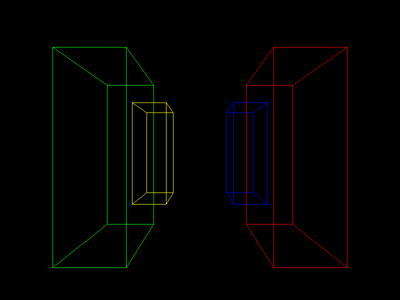
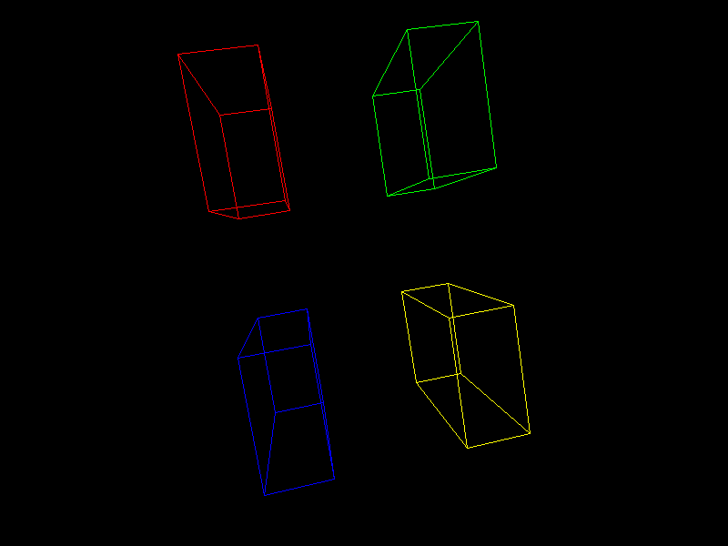
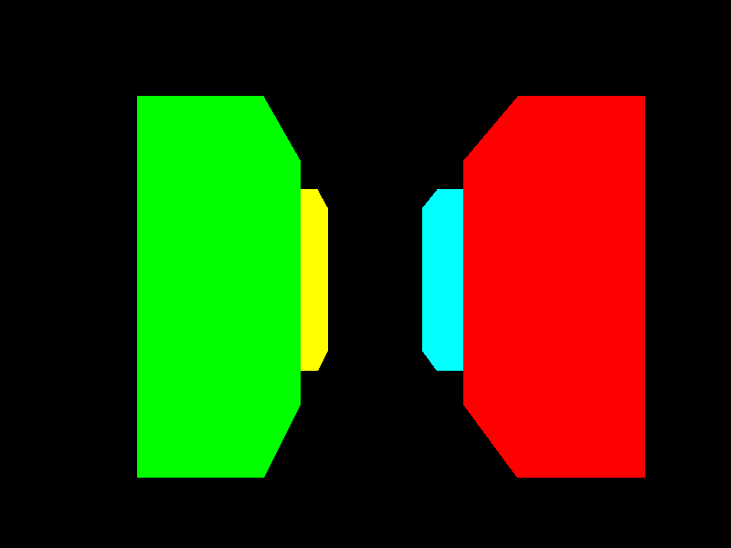
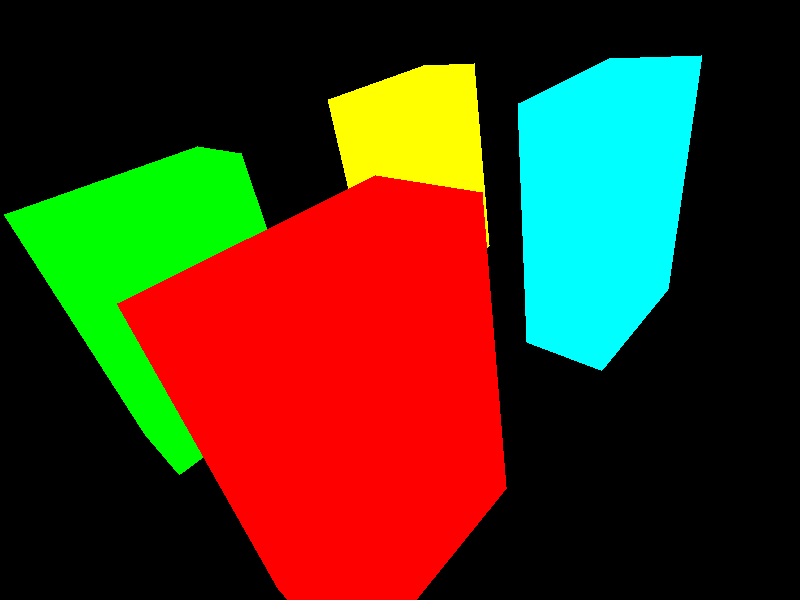

# Virtual Camera

The Virtual Camera Project is a software application developed using Python and the pygame library, designed to simulate a 3D camera environment. Users can interact with and navigate through a virtual space featuring multiple colored cuboids. Key features of the system include: 

<ul>
    <li><strong>Real-time 3D rendering:</strong> View and interact with 3D objects in a simulated environment.</li>
    <li><strong>Geometric transformations:</strong> Apply rotations, translations, and scaling to objects using keyboard inputs.</li>
    <li><strong>Perspective projection:</strong> Objects are projected onto a 2D screen from a 3D space using a simple perspective formula.</li>
    <li><strong>Interactive controls:</strong> Use the keyboard to manipulate the view and position of the camera in the virtual space.</li>
    <li><strong>Screenshot capability: </strong> Capture and save screenshots of the current view in the application.</li>
  </ul>

  # Screenshots

  

  

  # Painter algorithm

  

  The Painters Algorithm Project is a Python-based application utilizing the pygame library to implement the Painter's algorithm, a technique used in computer graphics to render 3D objects on a 2D display by sorting surfaces by depth and drawing them in correct back-to-front order. Users can manipulate and navigate through a virtual space filled with colorful cuboids.
   

 # Screenshots

  
  
  
